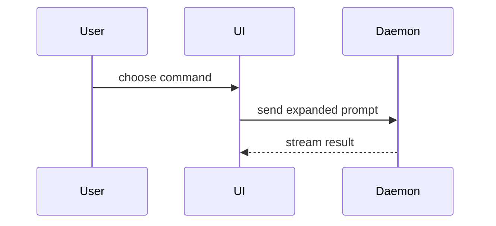

Help the user understand the current topic of conversation visually. Skip the preamble and keep prose brief. Pick the smallest view that makes the key point clear.

- Show logic or an algorithm as pseudocode:

```text
on(save)
  if content is unchanged
    return cached result
  write new content
  return fresh result
```

- Show runtime control flow as a call graph in a `claude-code-callgraph` block. It renders natively in Claude Code with syntax colors, so never use `text` or `diff` for call trees. Conventions: an `entry` line for the root, tree glyphs for callees, a signature with `→` return type, and two spaces before a trailing `path:line`, `path (new)`, or `(external)`:

```claude-code-callgraph
entry  submitForm(input: FormInput) → Promise<Session>  src/routes/session.tsx:12
├── createSession(input)  src/sessions/create.ts:4
│   ├── persistPrompt(prompt: string)  src/sessions/persist.ts:9
│   └── launchAgent(session: Session)  src/agents/launch.ts:40
└── navigateToSession()  (external)
```

- Show UI structure as a component tree, including state and module boundaries that matter:

```tsx
<SessionPage> (apps/example/src/routes/session.tsx)
  useSessionEvents()
  <SessionToolbar>
    <RunSkillButton> (packages/ui)
```

- Show file responsibility or a broad refactor as a shallow file tree:

```text
src/
├── commands/       # parses user actions
├── sessions/       # owns session state
└── transport/      # sends API requests
```

- Show component interaction, control flow, or data flow with Mermaid:



- Use `diff` when the point is what changes and the surrounding shape already exists. Match the diff shape to the topic.

For a component change:

```diff
 <SessionPage>
   useSessionEvents()
   <SessionToolbar>
+    <RunSkillButton />
   <SessionTimeline>
+    <SkillResultCard />
```

For a file-layout change:

```diff
 src/
 ├── commands/
+│   └── show-me.ts       # expands the slash command
 ├── sessions/
-└── transport.ts
+└── transport/
+    ├── client.ts
+    └── stream.ts
```

For a call-graph or call-stack change, keep the `claude-code-callgraph` block and mark rows with `+ ` added, `! ` changed, `- ` removed, unmarked for context:

```claude-code-callgraph
entry  submitForm(input: FormInput) → Promise<Session>  src/routes/session.tsx:12
  ├── createSession(input)  src/sessions/create.ts:4
+ │   ├── expandSkillMention(text: string)  src/skills/expand.ts (new)
  │   ├── persistPrompt(prompt: string)  src/sessions/persist.ts:9
! │   └── launchAgent(session: Session, skills: Skill[])  src/agents/launch.ts:40
- └── navigateToSession()  (external)
+ └── navigateToSession()  src/routes/navigate.ts:3
+     └── subscribeToEvents(session: Session)  src/events/subscribe.ts:15
```

For a state or control-flow change:

```diff
 on(save)
-  write content
+  if content is unchanged
+    return cached result
+  write new content
+  invalidate cache
```

- Show the whole block when most of it is new, when omitted context would hide ownership or order, or when the user needs a copyable target shape:

```ts
function expandSkill(command: string): string {
  const skillName = command.slice(1)
  return `use the ${skillName} skill`
}
```

- For a visual UI, layout, state comparison, or concept too dense for Mermaid, write one focused HTML file — a diagram, an infographic, or a short slide deck, whichever fits the point. Match the product's colors, type, spacing, and components; use real labels and data; support desktop and mobile. Then open it for the user:

```
Bash(open path/to/show-me-{description}.html)
```

### guidance

Place each visual next to the short text it supports. Keep only the calls, files, props, states, and boundaries needed to answer the user's current question or the options to resolve the current discussion point.

You may use one of these, you may use several, it is unlikely you will use all of them. Use your judgement and don't overwhelm the user.
